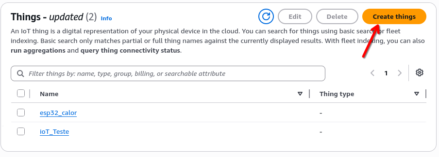
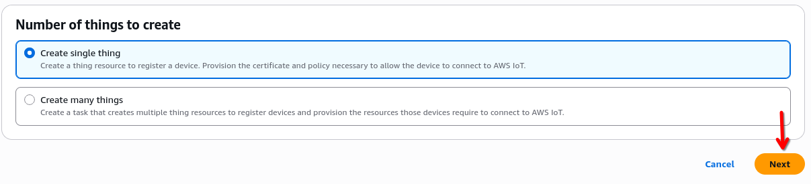
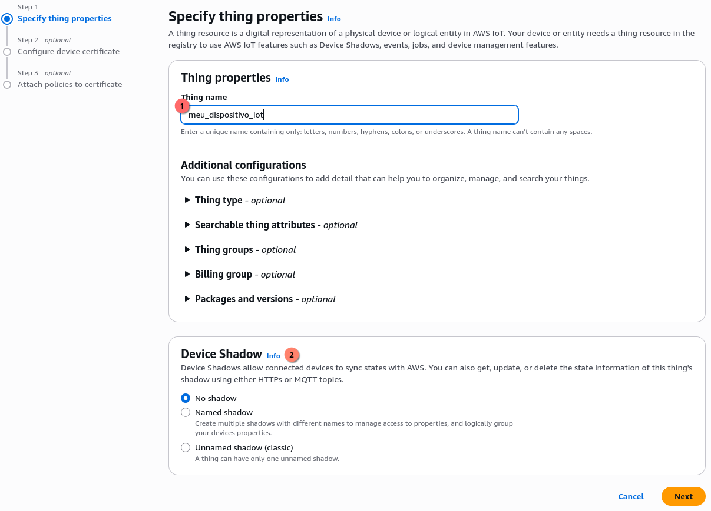
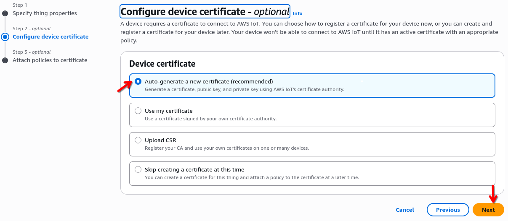
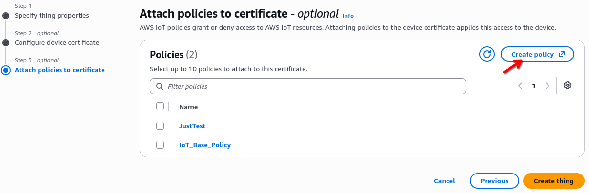
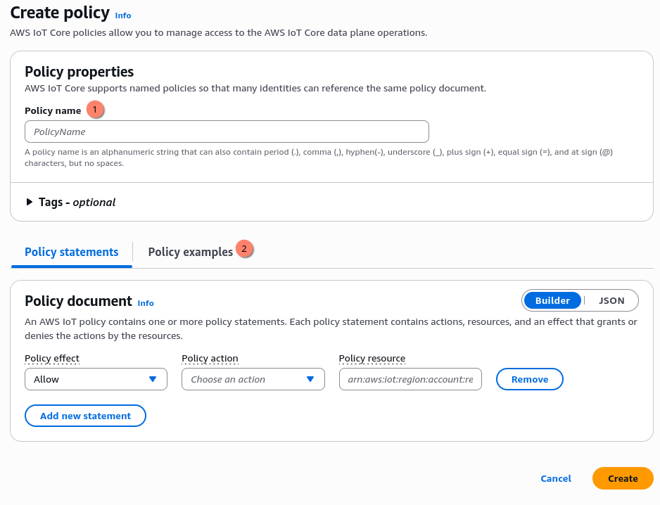
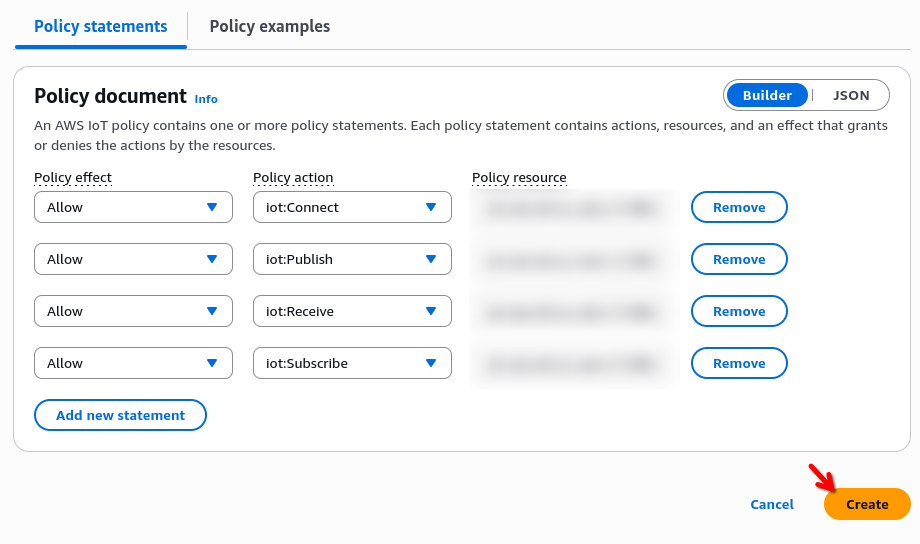
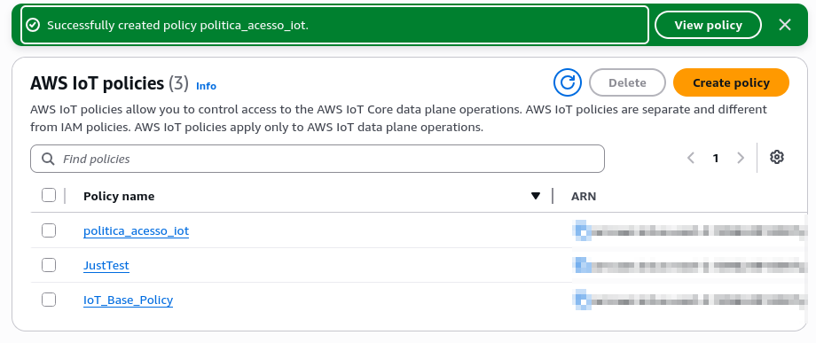
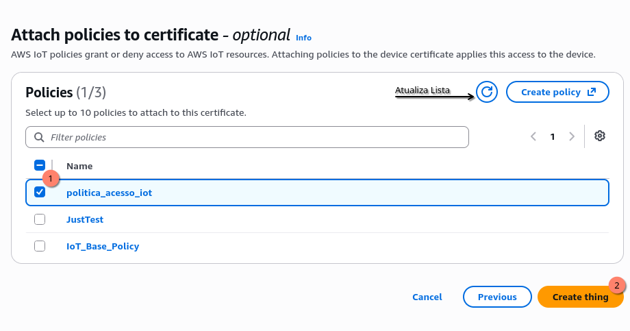
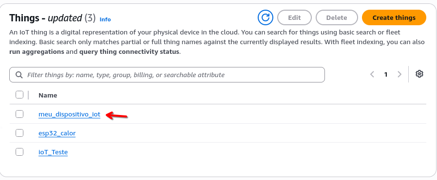

# Plataformas IoT

Tudo que vimos até agora se aplica em pequena escala e na forma que chamamos de
**on-premises**, ou seja, com o equipamento situado em nosso ambiente de aplicação.
Conforme o volume de clientes, equipamentos e processamento cresce, manter essa
infraestrutura começa a ficar mais difícil. 

Para isso, tanto a AWS como Azure contam com soluções focadas especificamente em
IoT, IoT Core e IoT Hub especificamente. Claro que é possível construir essa
mesma infraestrutura em plataformas que não tem esse produto dedicado, contudo
essas ferramentas facilitam diversos pontos do processo de gerenciamento da
solução IoT.

# Arquitetura de um sistema IoT

Quando pensamos em uma Arquitetura IoT podemos dividi-la em duas seções
principais, uma composta pelas "Coisas" que chamamos de **edge** e outra
composta pela **_cloud_**. A comunicação entre as duas partes é feita através de
um **gateway**.  


Os dispositivos da __edge__ podem se comunicar diretamente com o __"Cloud
Gateway"__ caso consigam, como é o caso da ESP32 que já possui módulo WiFi. Ou
pode ser necessário agregar as informações dos sensores e controladores em um
__"Edge Gateway"__ que esse sim se comunica com o __"Cloud Gateway"__.


O Cloud Gateway atua como um endpoint único que distribui milhões de conexões
MQTT entre múltiplos servidores internos. Ele gerencia o peso das sessões
persistentes e a segurança (TLS) de forma nativa, garantindo alta
disponibilidade e escalabilidade sem que você precise gerenciar o hardware.

Depois que o gateway recebe a informação da borda, é possível utilizar as
ferramentas internas da sua cloud para o consumo, tratamento, e dispersão dos
dados, o que garante uma camada maior de segurança de sua aplicação

Caso você utilize uma plataforma cloud que não ofereça o serviço de IoT
dedicado, todas as camadas de gerenciamento e segurança deverão ser
desenvolvidas por sua solução. 

Nos próximos tópicos estaremos configurando o AWS IoT Core para conectar um dispositivo a Cloud.

## IoT Core: Criando um __Thing__. 

Depois de feito login em seu console da AWS procure em serviços *Internet of
Things*


Depois procure por IoT Core e acesse. 


Para fazer a integração, precisamos criar um _"Thing"_, no menu esquerdo
procure por `Manage > All Devices > Things` e acesse. 

Nesta pagina é possível gerenciar todos os seus dispositivos. Para criar um novo,
clique no botão __"Create things"__



Podemos criar diversos dispositivos de uma só vez, ou apenas um. Por
simplicidade criaremos apenas um. Selecione _"Create single thing"_ e clique
em _Next_





O próximo passo é definir alguns atributos da "Coisa" que estamos criando. Ela
irá precisar de um nome identificador. Este será o ID do dispositivo na
plataforma.

> *Device Shadow (Gêmeo Digital)*: A nuvem mantém uma cópia virtual do estado do
> dispositivo. Se um sensor ficar offline, o aplicativo lê o "Shadow". Quando o
> sensor volta, a AWS sincroniza o estado automaticamente. Para este documento
> não utilizaremos.



Agora a AWS irá pedir para criar um certificado para o dispositivo se conectar a
plataforma. Selecione _"Auto-generate a new certificate"_ assim a amazon irá
gerar todos os certificados necessários. Depois de selecionado clique em _Next_




Próximo passo é criar uma política de acesso, que é responsável por habilitar ou
negar o acesso a serviços dentro da plataforma. Para criar uma nova política
clique em _"Create policy"_. Uma nova aba será aberta para fazer esse processo. 




Precisamos definir um nome para essa nova politica de acesso, e depois vamos utilizar
as _"Policy Examples"_ para iniciar a criação dela. 





Ao clicar em _"Policy Examples"_ procure por aquela que com o nome `Publish to
any topic prefixed by the thing name`, clique em sua caixa de seleção e depois
em _"Add to policy"


Feito isso, alguns __statements__ já foram criados para nós, e o mais importante
com o campo __Policy resource__ correto, que é algo como 

```
arn:aws:iot:<Sua Região>:<Seu User ID>:client/${iot:Connection.Thing.ThingName}
```

Agora abra o editor json e deixe o como o código abaixo. _Preste atenção na
string do Resource! Você deverá trocar pelas suas informações_

```json
{
  "Version": "2012-10-17",
  "Statement": [
    {
      "Effect": "Allow",
      "Action": "iot:Connect",
      "Resource": "arn:aws:iot:<Sua Região>:<Seu User ID>:client/${iot:Connection.Thing.ThingName}"
    },
    {
      "Effect": "Allow",
      "Action": "iot:Publish",
      "Resource": "arn:aws:iot:<Sua Região>:<Seu User ID>:topic/esp32/${iot:Connection.Thing.ThingName}/*"
    },
    {
      "Effect": "Allow",
      "Action": "iot:Receive",
      "Resource": "arn:aws:iot:<Sua Região>:<Seu User ID>:topic/esp32/${iot:Connection.Thing.ThingName}/*"
    },
    {
      "Effect": "Allow",
      "Action": "iot:Subscribe",
      "Resource": "arn:aws:iot:<Sua Região>:<Seu User ID>:topicfilter/esp32/${iot:Connection.Thing.ThingName}/*"
    }
  ]
}
```

{:.attention}
> Podemos utiliza a seguinte politica para testes, contúdo essa é uma falha crítica
> de segurança
```json 
{
  "Version": "2012-10-17",
  "Statement": [
    {
      "Effect": "Allow",
      "Action": "iot:*",
      "Resource": "*"
    }
  ]
}
```
> Essa política concede poder total (Allow *) sobre todo o seu ambiente IoT.
> 
> O Problema: Ela viola o Princípio do Menor Privilégio. Se um único sensor for invadido, o hacker ganha a "chave mestra" para controlar, espiar ou deletar toda a sua frota. Segurança zero!

Feito isso verifique se está tudo correto, e clique em _"Create"_




Esta política implementa um isolamento de segurança por dispositivo:

O que faz: Permite conectar, publicar, receber e subscrever mensagens.

A restrição: O dispositivo só pode atuar em recursos (tópicos e IDs) que
correspondam exatamente ao seu próprio Thing Name.

Na prática, ela impede que um dispositivo interaja com os dados de outro, mesmo
usando a mesma política.

Depois da politica criada ela estará listada em sua lista de políticas




Agora volte a página anterior, se sua nova politica não estiver listada, clique
no botão de atualização. Selecione a política recem criada, e clique em _"Create
thing"_.




<span style="color:red; font-size:2em">CUIDADO!</span> Depois de clicar em
_"Create thing"_ será apresentado um pop-up para download dos certificados. Essa
é a unica vêz que eles podem ser baixados. Certifique-se de fazer
download de todos e guarda-los em um lugar seguro.


Esses certificados serão utilizados para garantir a identidade de nossos
dispositívos. 

Depois de feito o download, clique em _"Done"_, seu dispositívo deverá ser
listado na lista de __Things__





